

  

# X-Flagr

**Professional moderation tool for X.com/Twitter community managers and moderators.**

Mark rule-breaking users with colored labels for better community management and faster identification of repeat offenders.

---

## 🎯 Features

### Core Functionality
- ✅ **User Marking System** - Mark users with specific rule violations
- 🎨 **Color-Coded Labels** - Instantly identify rule breakers with distinct colors
- 💾 **Persistent Storage** - All markings survive browser restarts
- 📊 **Violation Counter** - Track repeat offenders automatically
- 🔄 **Real-Time Updates** - Labels appear instantly on X.com/Twitter
- 📈 **Advanced Analytics Dashboard** - Comprehensive statistics and insights
- ⚡ **Quick-Mark Feature** - Mark users directly from tweets with one click
- 🏆 **Reputation Score** - Automated reputation calculation for each user
- 📉 **Trend Analysis** - Track user behavior trends over time

### Advanced Features
- 🔔 **Browser Notifications** - Get notified when marking users (optional)
- 👁️ **Toggle Labels** - Show/hide labels with one click
- 🔍 **Filter by Rule** - View violations by specific rule categories
- 📱 **Modern UI** - Sleek, professional interface with smooth animations
- 📊 **Violations Heatmap** - Visual representation of violations by day/time
- 📈 **Week-over-Week Comparison** - Track moderation trends
- 📋 **CSV Export** - Export weekly/monthly reports
- 🎯 **Top Offenders List** - Identify most problematic users
- 📝 **User Notes** - Add custom notes to user profiles
- 🗑️ **Individual Violation Removal** - Remove single violations without deleting entire user

### Community-Specific
- 🏘️ **Community-Only Mode** - Extension only works within X.com communities
- 🎯 **Smart Detection** - Auto-suggest violations based on tweet content
- 🔄 **Real-Time Sync** - Instant updates across all open tabs

---

## 📸 Screenshots

### Main Interface
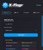

*Main popup interface showing the Users tab*

### User Management
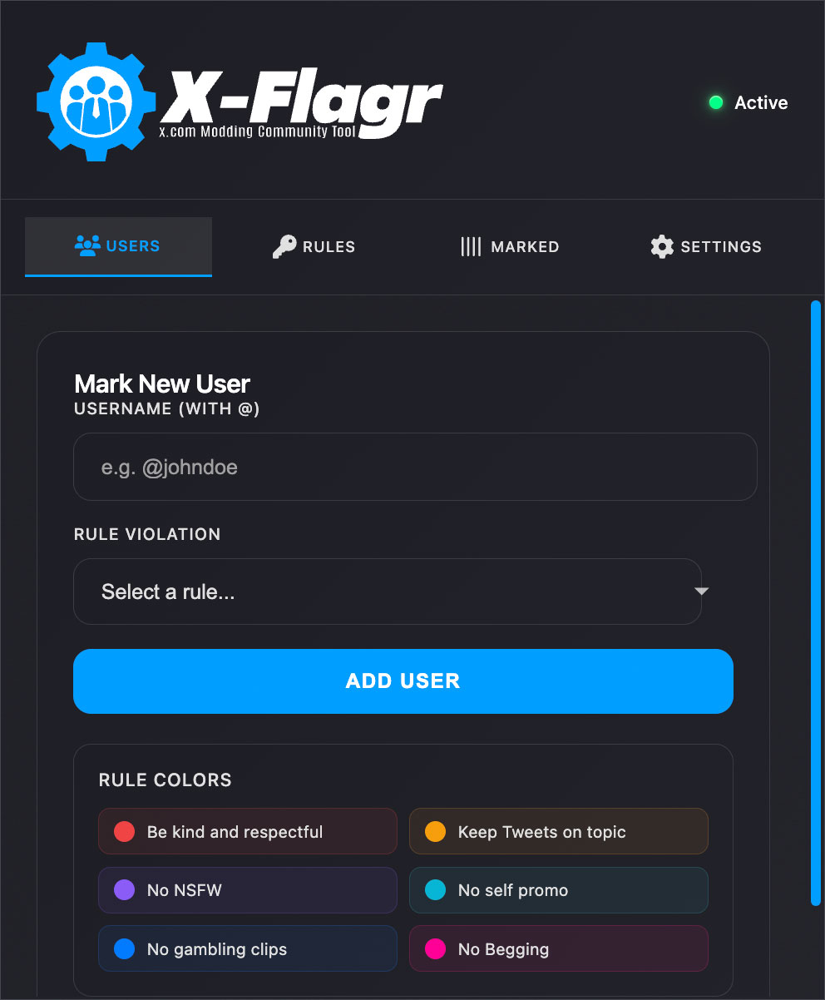

*Add new users and assign rule violations*

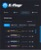

*View all marked users with analytics and filtering options*

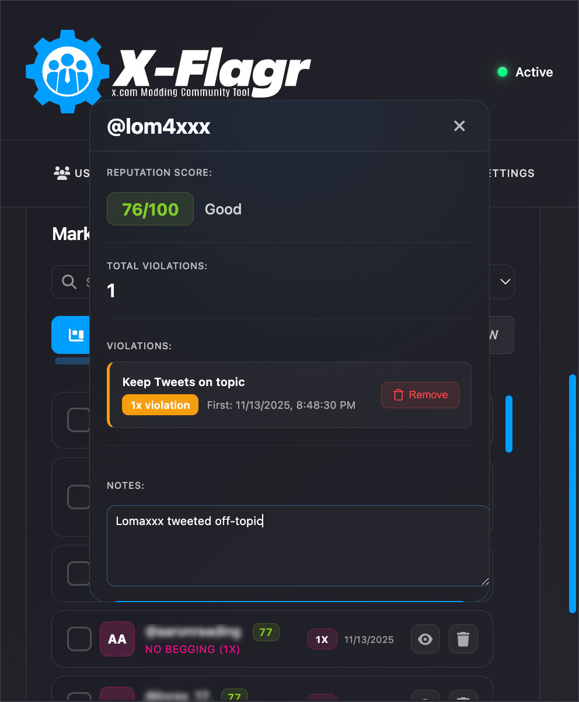

*Detailed user information panel with reputation score and violation history*

### Rule Management
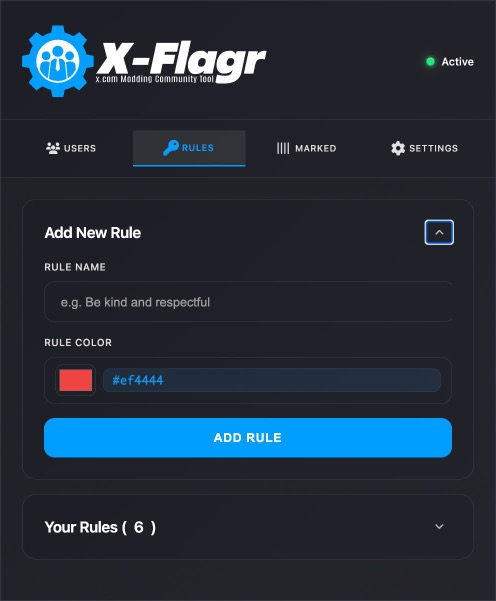

*Create custom rules with color coding*

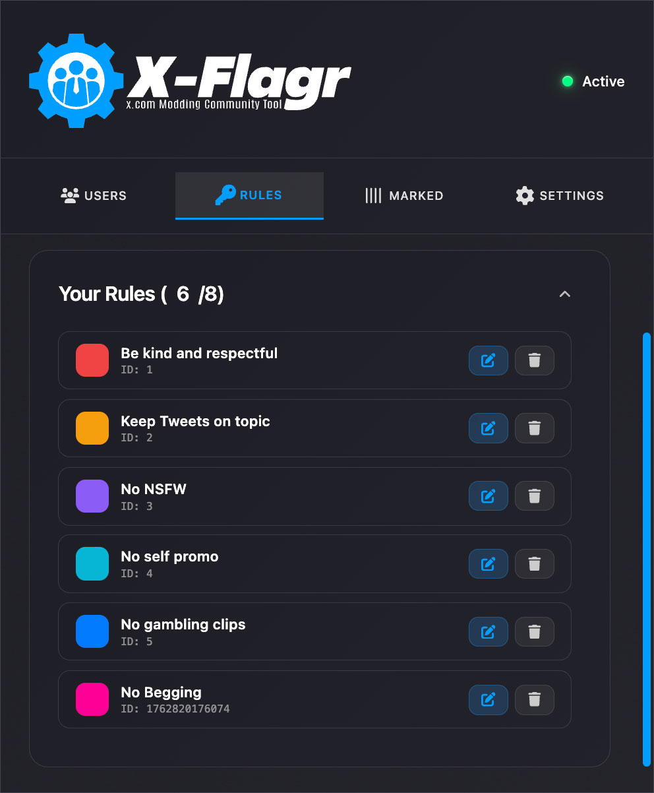

*Manage and edit existing rules*

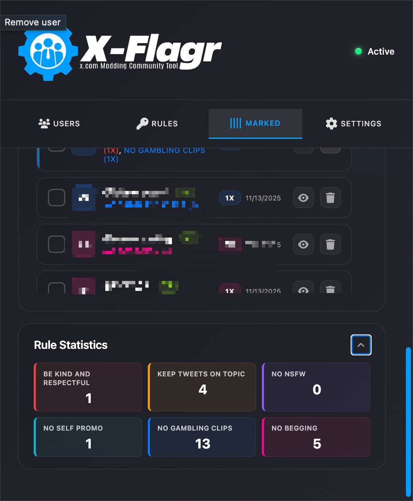

*Statistics breakdown by rule category*

### Analytics & Reports
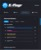

*Comprehensive analytics dashboard with charts and insights*

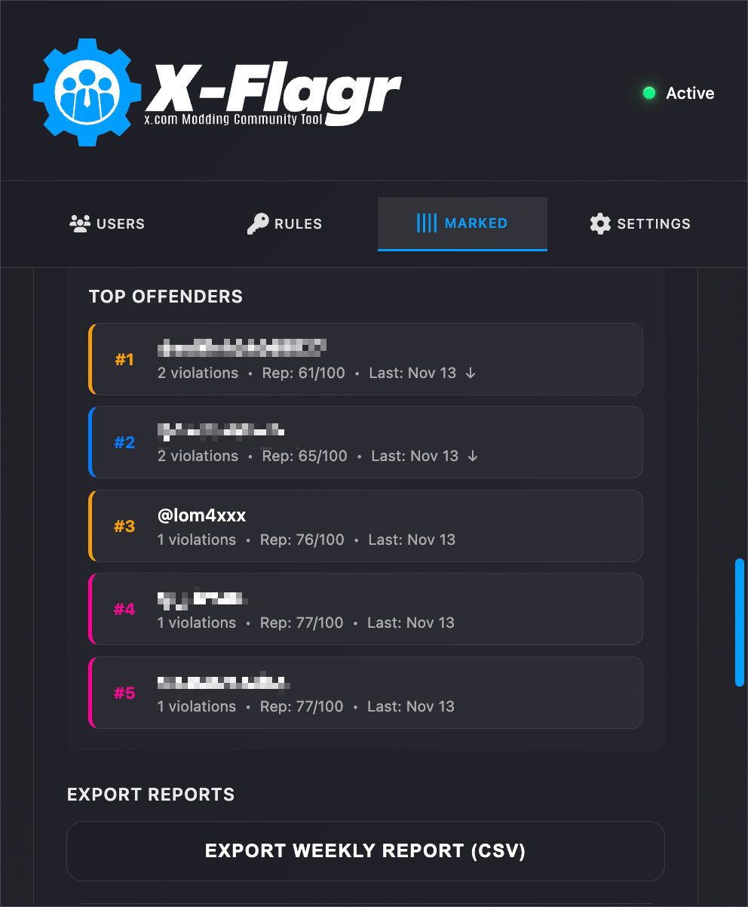

*Top offenders list with violation counts and trends*

### Quick Actions
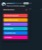

*Quick-mark feature for instant user marking from tweets*

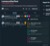

*User details panel displayed over X.com tweet view*

---

## 📦 Installation

### Manual Installation (GitHub)

1. **Download the Extension**
   - Go to [Releases](https://github.com/Lomaxxx-xflagr/X-Flagr/releases)
   - Download the **"X-Flagr-v1.0.1.zip"** file from the Assets section (this ZIP does NOT include screenshots)
   - ⚠️ **Important**: Do NOT use the "Source code (zip)" download - that includes screenshots and other files not needed for the extension
   - Extract the ZIP file to a location of your choice

2. **Install in Chrome/Edge/Brave**
   - Open your browser and navigate to:
     - Chrome: `chrome://extensions/`
     - Edge: `edge://extensions/`
     - Brave: `brave://extensions/`
   - Enable **"Developer mode"** (toggle in top-right corner)
   - Click **"Load unpacked"**
   - Select the extracted folder (the one containing `manifest.json`)
   - The extension is now installed and ready to use!

3. **Verify Installation**
   - Look for the X-Flagr icon in your browser toolbar
   - Click it to open the extension popup
   - You should see the main interface

---

## 🚀 Quick Start Guide

### Step 1: Create Rules
1. Click the extension icon in your browser toolbar
2. Navigate to the **"Rules"** tab
3. Click **"Add Rule"**
4. Enter a rule name (e.g., "No Spam")
5. Choose a color for the rule
6. Click **"Add Rule"**

### Step 2: Mark a User (Method 1 - Popup)
1. Click the extension icon
2. Enter the username (with or without @)
3. Select the rule violation from the dropdown
4. Click **"Add User"**

### Step 2: Mark a User (Method 2 - Quick-Mark)
1. Navigate to an X.com community page
2. Find a tweet that violates a rule
3. Click the **warning icon** below the user's profile picture
4. Select the appropriate rule from the popup
5. The user is automatically marked!

### Step 3: View Labels on X.com
- Visit any X.com/Twitter community page
- Marked users will automatically display colored labels next to their usernames
- Labels show the violation count and rule color
- Click on a label to see detailed user information

### Step 4: Manage Marked Users
1. Open the extension popup
2. Navigate to **"Marked"** tab
3. View all marked users with statistics
4. Filter by specific rules using the rule tabs
5. Click on a user to see detailed information
6. Remove individual violations or entire users

---

## 📊 Analytics & Reports

### Overview Dashboard
- **Total Users**: Number of marked users
- **Active Labels**: Currently visible labels
- **Rule Violations**: Total violation count
- **Today's Activity**: Users marked today

### Advanced Analytics
- **Violations Over Time**: Visual chart showing violation trends
- **Week Comparison**: Compare current week vs. previous week
- **Violations Heatmap**: See when violations occur most frequently
- **Top Offenders**: List of users with most violations
- **Reputation Scores**: Automated reputation calculation (0-100)
- **Trend Indicators**: See if user behavior is improving or declining

### Reports
- **Weekly Report**: Export CSV with all violations from the past week
- **Monthly Report**: Export CSV with all violations from the past month
- Includes: Username, Rule, Count, First Violation Date, Last Violation Date

---

## ⚙️ Settings

### Labels Display
Toggle the display of labels on X.com/Twitter pages. When disabled, labels are hidden but data is preserved.

### Notifications
Enable browser notifications when marking new users. Useful for team coordination and tracking.

### Data Management
- **Export Data**: Download all your data (users, rules, settings) as JSON
- **Import Data**: Restore from a previously exported backup
- **Privacy Policy**: View our privacy policy

---

## 🔒 Privacy & Security

### Data Storage
- ✅ All data is stored **locally** in your browser
- ✅ No data is sent to external servers
- ✅ No tracking or analytics
- ✅ No personal information collected
- ✅ No account credentials accessed

### Permissions Explained
- **Storage**: Save marked users and settings locally
- **ActiveTab**: Inject labels on X.com/Twitter pages
- **Notifications**: Send browser notifications (optional feature)
- **Host Permissions**: Access X.com and Twitter.com domains only (for community pages)

### Privacy Policy
For detailed information about data handling, please see our [Privacy Policy](PRIVACY_POLICY.md).

---

## 🛠️ Technical Details

- **Manifest Version**: 3 (Latest Chrome Extension API)
- **Browser Support**: Chrome, Edge, Brave, Opera (Chromium-based browsers)
- **Framework**: Vanilla JavaScript (no dependencies)
- **Storage**: Chrome Storage API (local only)
- **Performance**: Lightweight with MutationObserver for real-time updates
- **Security**: XSS protection with HTML escaping, input validation

---

## 💡 Tips & Best Practices

### For Solo Moderators
- Use the analytics dashboard to track trends
- Enable notifications to stay informed
- Review the "Today's Activity" metric regularly
- Use the reputation score to prioritize moderation efforts
- Export data regularly as backup

### For Moderation Teams
- Establish consistent rule categorization
- Use the filter tabs to focus on specific violations
- Share exported data files with team members for unified tracking
- Use user notes to add context about violations
- Review top offenders list regularly

### Performance Optimization
- Use the toggle feature to hide labels when not needed
- Regularly review and clean up old markings
- Export and archive old data periodically

---

## 🐛 Troubleshooting

### Labels Not Appearing
1. Ensure you're on an X.com community page (not regular timeline)
2. Check that labels are enabled in Settings
3. Refresh the X.com/Twitter page
4. Verify that the user is actually marked in the extension

### Quick-Mark Button Not Visible
1. Make sure you're on a community page (`/i/communities/`)
2. Refresh the page
3. Check that the extension is enabled in `chrome://extensions/`
4. Try clicking on a tweet to view it in detail view

### Extension Not Working
1. Verify the extension is enabled in `chrome://extensions/`
2. Check for browser updates
3. Try reloading the extension (click the reload icon)
4. Reinstall the extension if issues persist

### Data Lost
- Data is stored locally - clearing browser data will remove markings
- Export important data before clearing browser storage
- Use the Import feature to restore from backups

---

## 📝 Changelog

### Version 1.0.1
- ✨ Added Quick-Mark feature with inline button
- ✨ Added Reputation Score calculation and display
- ✨ Added Advanced Analytics (heatmap, week comparison, top offenders)
- ✨ Added CSV export for weekly/monthly reports
- ✨ Added individual violation removal
- ✨ Added user notes functionality
- ✨ Added community-only mode (extension only works in communities)
- 🐛 Fixed label display issues
- 🐛 Fixed button visibility in tweet details
- 🔒 Improved security with better input validation
- 🎨 Improved UI/UX with better layout and spacing

### Version 1.0.0
- 🎉 Initial release
- ✅ User marking system with custom rules
- ✅ Color-coded labels
- ✅ Analytics dashboard
- ✅ Browser notifications
- ✅ Modern UI with dark theme

---

## 🤝 Contributing

Contributions are welcome! Please feel free to submit a Pull Request.

1. Fork the repository
2. Create your feature branch (`git checkout -b feature/AmazingFeature`)
3. Commit your changes (`git commit -m 'Add some AmazingFeature'`)
4. Push to the branch (`git push origin feature/AmazingFeature`)
5. Open a Pull Request

---

## 📧 Support

For questions, feature requests, or bug reports:
- 🐛 [Open an Issue](https://github.com/Lomaxxx-xflagr/X-Flagr/issues)
- 💬 [Discussions](https://github.com/Lomaxxx-xflagr/X-Flagr/discussions)

---

## ⚠️ Known Issues

I'm aware that there are still some minor cosmetic issues and imperfections here and there. These will be addressed gradually over time as I continue to improve the extension.

**Current known limitations:**
- ⏱️ **Real-time updates**: The real-time display of labels and buttons may occasionally require a page refresh in some edge cases. This is a known issue that will be refined in future updates.

**Important note:** Despite these minor issues, the extension is **fully functional and more than helpful** in its current state. All core features work reliably, and the tool provides significant value for community moderation tasks.

I'm committed to continuously improving X-Flagr, and these cosmetic issues will be polished over time as part of the ongoing development process.

---

## 📄 License

This project is licensed under the MIT License - see the [LICENSE](LICENSE) file for details.

---

## 🙏 About This Project

This is a **hobby project** that was born out of personal necessity. As a community moderator myself, I found that the built-in moderation tools provided by X.com are quite limited or simply non-existent. When managing large communities with thousands of users, it's easy to lose track of repeat offenders and their violation history.

**X-Flagr** was created to solve this problem—to help moderators like myself maintain better oversight and remember important context about users who repeatedly violate community rules.

### 💡 Feedback & Contributions

I'm always open to **suggestions for improvements** and welcome constructive feedback! However, please keep in mind that this is a personal hobby project developed primarily for my own use. While I appreciate contributions and ideas, development happens in my spare time and is driven by my own needs as a moderator.

If you have ideas, feature requests, or encounter bugs, feel free to [open an issue](https://github.com/Lomaxxx-xflagr/X-Flagr/issues) or start a [discussion](https://github.com/Lomaxxx-xflagr/X-Flagr/discussions). I'll do my best to address them when time permits.

---

**Made with ❤️ by [Lomaxxx](https://github.com/Lomaxxx-xflagr)**

